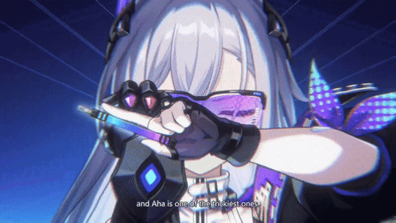
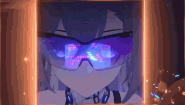

<!-- HEADER -->

  

<!-- GIF -->

  

<!-- PLAYER PROFILE -->

  

  
  
  
  
  
  
  

<!-- ACTIVITY MAP -->

  

  

<!-- SKILL TREE -->

  

  
  
  
  

<!-- TECH STACK -->

  

 
     
     
     
     
     
     
   

  

  
  
  

<!-- PLAYER STATS -->

  

<!-- ADVANCED STATS -->

  

  
  

  
  

<!-- LIVE STATUS -->

  

 
   

<!-- GIF -->

  

<!-- CONTACT -->

  

  

  

  

  

